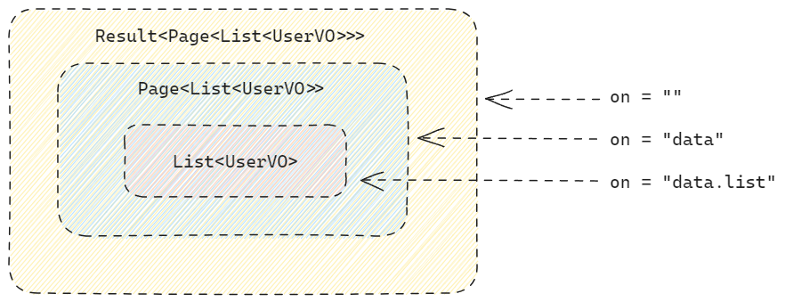

# 触发操作

当你在类中配置好了要执行的填充操作后，你需要触发操作的执行，然后才能真正的完成填充。

crane4j 支持手动和自动填充，前者通常通过执行器 `BeanOperationExecutor` 或工具类 `OperateTemplate` 在代码中完成，后者一般在与 Spring 集成后，通过 SpringAOP 在方法调用前后自动完成。

## 1.手动填充

手动填充分为两种方式，一种方式是直接使用 `OperateTemplate` 工具类，另一种则是直接使用最底层的 `BeanOperationExecutor` 的 API 完成，一般我们推荐使用第一种。

### 1.1.使用 OperateTemplate

`OperateTemplate` 是 `crane4j` 提供的工具类，命名参考了 Spring 提供的各种 `XXXTemplate`：

~~~~java
List<Foo> foos = fooService.list();
OperateTemplate template = SpringUtil.getBean(OperateTemplate.class);
OperateTemplate.execute(foos);
~~~~

`OperateTemplate` 可以按照默认配置完成整个填充流程，但它也提供了多种重载方法，允许你在参数中指定要使用的组件或过滤器。

### 1.2.使用执行器

另一种是先使用配置解析器 `BeanOperationParser` 获得配置对象，然后再使用执行器 `BeanOperationExecutor` 完成操作：

~~~java
// 获取操作配置
BeanOperationParser parser = SpringUtil.getBean(BeanOperationParser.class);
BeanOperations operation = parser.parse(Foo.class);
// 根据操作配置执行填充
BeanOperationExecutor executor = SpringUtil.getBean(BeanOperationExecutor.class);
List<Foo> foos = fooService.list();
executor.execute(foos, operation);
~~~

一般很少会直接使用这种方式完成。

## 2.自动填充

在 crane4j 中，你可以基于代理来实现自动填充方法的参数和返回值，这种方式称为**自动填充**。

在 Spring 环境中，crane4j 会借助 Spring AOP 实现，而在非 Spring 环境中，你可以通过手动代理实现类似的效果：

~~~java
// 创建一个全局配置类
Crane4jGlobalConfiguration configuration = SimpleCrane4jGlobalConfiguration.create();
// 创建一个代理工厂
AutoOperateProxy autoOperateProxy = ConfigurationUtil.createAutoOperateProxy(configuration);
// 创建代理对象
Example example = new Example();
Example proxy = autoOperateProxy.wrapIfNecessary(example);

// 调用被代理的方法，此时会触发自动填充
proxy.doSomething();
~~~

### 2.1.配置

**填充方法返回值**

当我们在方法上添加 `@AutoOperate` 后，切面类 `MethodResultAutoOperateAdvisor` 即可在方法返回时对返回值进行自动填充：

~~~java
@AutoOperate(type = Foo.class)
public List<Foo> getFooList() {
    // do nothing
}
~~~

返回值类型可以是单个对象、对象数组或对象的 `Collection` 集合。

**填充方法入参**

你也可以在方法参数上添加 `@AutoOperate` 注解，切面类 `MethodArgumentAutoOperateAdvisor` 会在方法执行前，对入参进行自动填充：

~~~java
public void getFooList(@AutoOperate(type = Foo.class) Foo foo) {
    // do nothing
}
~~~

或者，你也可以按照 swagger 的写法，将注解放到方法上，此时则需要显式的指定要绑定的参数名：

~~~java
@ArgAutoOperate(
    @AutoOperate(value = "foo", type = Foo.class)
)
public void getFooList(Foo foo) {
    // do nothing
}
~~~

两种方式效果一致，你可以根据情况自行选择。

### 2.2.自动类型推断

在某些情况下，无法在编译期确定要填充的对象类型。此时，可以不指定 `type` 属性，而是在执行拆卸操作时动态推断类型：

```java
@AutoOperate // 无法确定填充类型
public List<T> getFooList() {
    // do nothing
}
```

上述示例中，无法在编译期确定 `getFooList` 的返回值类型，因此没有指定 `type` 属性。在执行自动填充操作时，会动态推断类型。

这个功能是通过类型解析器 `TypeResolver` 实现的。用户可以实现 `TypeResolver` 接口来替换默认的类型解析器，以适应特定的需求。

### 2.3.包装类提取

有时候，我们会在 `Controller` 中显式的使用通用响应体包装返回值，比如：

~~~java
@PostMapping
public Result<List<UserVO>> listUser(@RequestBody List<Integer> ids) {
    // 返回值被通用响应体包装
    return new Result<>(userService.listByIds(ids));
}

// 通用响应体
@AllArgsConstructor
@Data
public class Result<T> {
    private String msg = "ok";
    private Integer code = 200;
    private T data;
    public Result(T data) {
        this.data = data;
    }
}
~~~

此时，我们真正需要填充的数据其实是 `Result.data`，则可以在 `@AutoOperate` 注解中通过 `on` 属性指定：

~~~java
@AutoOperate(type = UserVO.class, on = "data") // 声明自动填充
@PostMapping
public Result<List<UserVO>> listUser(@RequestBody List<Integer> ids) {
    // 返回值被通用响应体包装
    return new Result<>(userService.listByIds(ids));
}
~~~


**多级包装**

在特定情况下，我们会存在多级包装的情况。比如通用响应体包装了分页对象，然后分页对象里面才是需要填充的数据。

由于 `on` 属性默认支持链式操作符，即可以通过`xx.xx.xx`的方式访问内部对象的属性，因此你可以使用这种方式来从被多层包装的对象中提取特定的属性值：

~~~java
@AutoOperate(type = UserVO.class, on = "data.list") // 声明自动填充
@PostMapping
public Result<Page<List<UserVO>>> listUser(@RequestBody List<Integer> ids, @RequestParam PageDTO pageDTO) {
    // Result.data -> Page.list -> List<UserVo>
    return new Result<>(userService.pageByIds(ids, pageDTO));
}
~~~



:::tip

如果未指定类型，而是让 crane4j 在运行时自动推断类型，那么类型推断时将以提取出的字段值为准。比如在上图表示的示例中，最终推断出来的类型会是 `UserVO`。

:::

### 2.4.条件表达式

通过注解的 `condition` 属性，可以设置应用条件的表达式。在执行填充之前，动态根据表达式的计算结果决定是否执行。

例如：

~~~java
@AutoOperate(type = Foo.class, condition ="#type != 1 && ${config.enable-fill-foo}")
public List<Foo> getFoo(Integer type) {
    // do nothing
}
~~~

上述示例表示只有当`type`不等于 `1` 且配置文件中的 `config.enable-fill-foo` 为 `true` 时，才会执行填充操作。

在 Spring 环境中，默认的表达式引擎是 SpEL 表达式，因此可以在表达式中使用 `#result` 引用返回值，使用 `#参数名` 引用方法的入参。

表达式最终的返回值可以是布尔值，也可以是字符串`'true'`或`'false'`。

:::tip

- 在 Spring 环境中，默认支持 SpEL 表达式，也可以更换表达式引擎以支持其他类型的表达式。
- 如果有必要，你也可以设置更细粒度的条件，以保证只针对特定对象的特定属性进行填充，具体参见 [设置操作触发条件](./operation_condition.md) 一节。

:::

### 2.5.指定分组

通过注解的 `includes` 或 `excludes` 属性可以设置本次执行的操作组。例如：

```java
@AutoOperate(type = Foo.class, includes = {"base", "foo"})
public List<Foo> getFoo(Integer type) {
    // do nothing
}
```

在上述示例中，执行填充操作时，只会完成带有 `base` 或 `foo` 组别的装配/拆卸操作。

:::tip

-   关于如何对操作分组，请参见 [操作分组](./operation_group.md) 一节。
-   你也可以通过设置操作的应用条件来实现类似的效果，具体参见 [设置操作触发条件](./operation_condition.md) 一节。

:::

### 2.6.指定执行器

通过注解的 `executor` 属性可以指定本次填充操作的执行器，不同的执行器会对填充操作产生不同的影响。

例如：

~~~java
// @AutoOperate(type = Foo.class, executorType = AsyncBeanOperationExecutor.class)
@AutoOperate(type = Foo.class, executorType = OrderedBeanOperationExecutor.class)
public List<Foo> getFoo(Integer type) {
    // do nothing
}
~~~

在上述示例中，指定的 `OrderedBeanOperationExecutor` 将按照规定的顺序同步执行填充操作，而 `AsyncBeanOperationExecutor` 则支持并发填充。

:::tip

- 关于执行器，请参照 "[基本概念](./../user_guide/basic_concept.md)" 一节中执行器部分内容。
- 关于如何使用异步执行器，请参见：[异步填充](./../advanced/async_executor.md)一节。

:::

### 2.7.从注解元素获取配置

在 2.7.0 及以上版本，你可以不配置 `type` 或通过动态解析返回值类型来获取操作配置，而是直接从被 `@AutoOperate` 注解的方法或者参数上获取操作配置。

比如：

~~~java
@Assemble(key = "id", container = "foo")
@AutoOperate(resolveOperationsFromCurrentElement = true) // 从 listByIds 方法上解析操作配置
public List<Foo> listByIds(Collection<Integer> ids);

public void preocessFoo(
  @Assemble(key = "id", container = "foo")
	@AutoOperate(resolveOperationsFromCurrentElement = true) // 从 targets 方法参数上解析操作配置
  Collection<Foo> targets
);
~~~

在上面这个写法中，你可以不必在 `Foo` 类中配置任何注解，当执行时，crane4j 将根据你在方法上的操作配置对返回值进行填充，或根据你在参数上的操作配置对入参进行填充。

:::tip

如果你希望基于一个独立的方法进行填充，那么可以参考 [基于方法填充](./../advanced/operator_interface.md) 一节，它同样也可做到类似的效果，并且更加灵活。

:::
