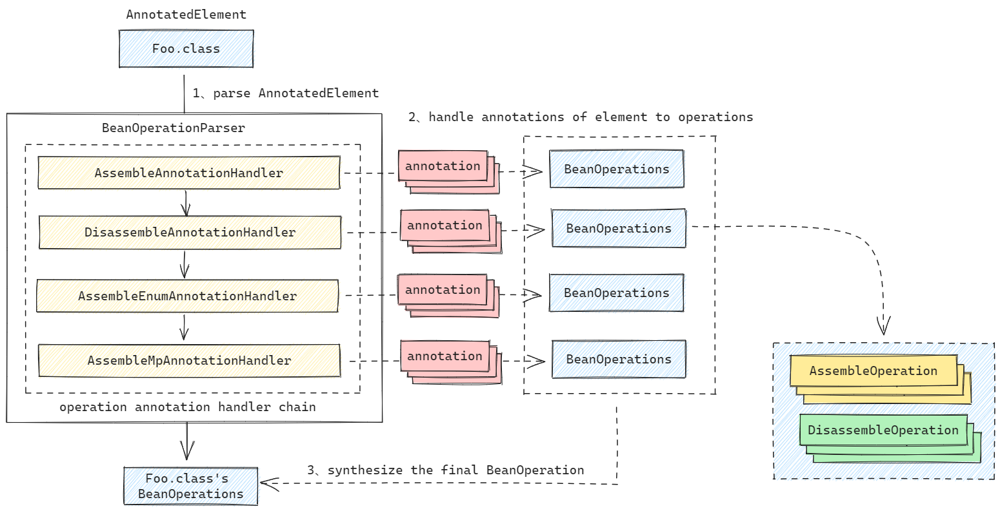
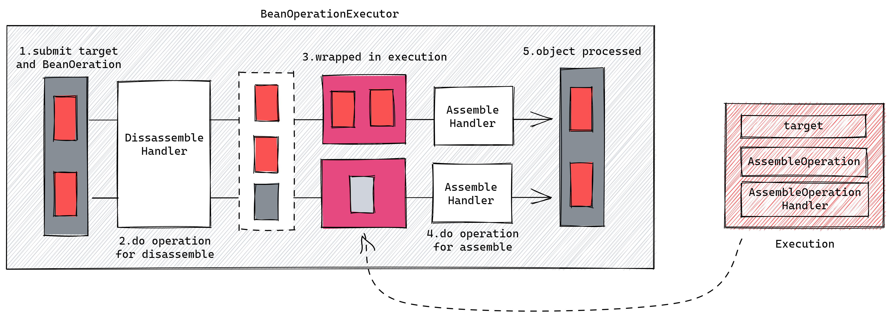

# 基本概念

在后续的内容中，可能会提到一些 crane4j 涉及的组件或概念，比如 “全局配置”、“数据源容器” 或者 “操作配置” 等，它们并不复杂，但是如果在开始后面的内容前提前了解这些概念，可能更会有助于你阅读后面的内容。

## 1.全局配置

crane4j 的运行依赖于 crane4j **全局配置**类 `Crane4jGlobalConfiguration`，里面用于存放框架运行时**所需要的所有组件和各种配置信息**。

你可以通过下述代码**基于默认配置手动创建一个全局配置对象**：

~~~java
// 创建一个默认配置类
Crane4jGlobalConfiguration configuration = SimpleCrane4jGlobalConfiguration.create();
~~~

而在 Spring 环境中，crane4j 已经通过自动装配**默认向 Spring 容器里面注册了一个配置对象**，你可以通过依赖注入获得它：

~~~java
@Autowired 
private Crane4jGlobalConfiguration configuration; // 从 Spring 获的默认配置类
~~~

全局配置对象通常是唯一的，你需要通过它完成包括数据源注册在内的各种必要操作。

## 2.数据源容器

每个填充操作都需要对应一个**数据源**，我们通常会通过外键从数据源中得到对应的数据——可能是单个对象，也可能是对象集合——用于后续填充。在 crane4j 中，一个数据源对应一个**数据源容器** (`Container`)，而每个容器都具备全局唯一的**命名空间** (`namespace`)。

你可以通过**指定的 key 值集合，从容器中得到按相应 key 值分组的数据对象 Map 集合**，比如：

~~~java
// 创建一个基于 Map 集合的容器
Container<Integer> mapContainer = Containers.forMap("map_container", new HashMap<Integer, Object>());
// 根据 key 值获得相应的数据
Map<Integer, Object> datas =  mapContainer.get(Arrays.asList(1, 2, 3));
~~~

你可以通过 `Containers` 工厂类**基于任何类型的数据源创建容器**，比如：

~~~java
// 基于 Map 集合创建一个容器
Container<Integer> mapContainer = Containers.forMap("map_container", new HashMap<Integer, Object>());
// 基于枚举类创建一个容器
Container<Integer> enumContainer = Containers.forEnum("enum_container", GenderEnum.class, GenderEnum::getCode, GenderEnum::getName);
// 基于函数式接口创建一个容器
Container<Integer> enumContainer = Containers.forLambda(
    "lambda_container", ids -> ids.stream().collect(Collections.toMap(id -> id, id -> id))
)
~~~

无论如何，在创建完容器后，你需要将其**注册到 crane4j 全局配置类**后才可以使用：

~~~java
// 创建一个默认配置类
Crane4jGlobalConfiguration configuration = SimpleCrane4jGlobalConfiguration.create();
// 创建一个基于 Map 集合的容器
Container<Integer> mapContainer = Containers.forMap("map_container", new HashMap<Integer, Object>());
// 将容器注册到全局配置对象
configuration.registerContainer(mapContainer);
~~~

crane4j 支持的容器远远不止这些，它还可以基于枚举、字典、方法和常量等数据源创建容器，你可以在后文 “[数据源容器](./../basic/container/container_abstract.md)” 一节查看具体内容。

## 3.操作配置&解析器

在 crane4j 中，“操作” (`Operation`) 泛指一切通过需要 crane4j 完成的行为，它们通常分为两类：

+ **装配操作** (`AssembleOperation`)：即指 “根据 A 的 key 值拿到 B，再把 B 的属性映射到 A” 这样一个动作；

+ **拆卸操作** (`DisassembleOperation`)：当存在需要填充的嵌套对象时，会先需要将其取出平铺后再进行填充，这种 “取出并平铺” 的操作就是拆卸操作；

无论如何，通常情况下**每个操作都对应类或类属性上的一个注解**：

~~~java
public class Foo {
    @Assemble( // 声明一个装配操作，key 值即为 Foo.id 的属性值
        container = "test_container", // 通过 namespace 引用数据源容器
        props = @Mapping(src = "name", ref = "name") // 获取关联的数据对象后，将其 name 映射到 Foo.name
    )
    private Integer id;
    private String name;

    @Disassemble(type = Foo.class) // 声明一个拆卸操作，当填充时，需要将 Foo.nested 取出后再一并填充
    private Foo nested;
}
~~~

一个类中可能会同时存在复数的装配操作与拆卸操作，它们通常不直接使用，而是以类为单位聚合为**类级别的操作配置** (`BeanOperations`)，我们可以通过**操作配置解析器** (`BeanOperationParser`)  ——它同样从全局配置类中获取——得到它：

~~~java
// 创建一个默认配置类
Crane4jGlobalConfiguration configuration = SimpleCrane4jGlobalConfiguration.create();
// 从全局配置类中获取配置解析器
BeanOperationParser parser = configuration.getBeanOperationsParser(BeanOperationParser.class);
// 使用解析器解析 Foo 类，并获得操作配置
BeanOperations operations = parser.parse(Foo.class);
~~~

你还可以在注解中调整字段的映射规则、指定操作的执行顺序，或通过指定分组来选择性的跳过一些操作，具体参见后文 “[装配操作](./../basic/declare_assemble_operation.md)” 与 “[属性映射](./../basic/property_mapping.md)” 相关内容。

## 4.注解处理器

crane4j 支持通过各种注解快速的配置填充和拆卸操作，它们实际上是通过注册在操作配置解析器 `BeanOperationParser` 中的注解处理器 `OperationAnnotationHandler` 进行处理的。

当我们使用解析器对类及类的属性进行解析式，都会依次调用一遍注解处理器，每种注解处理器都专注于将某一类注解解析为相应的转配操作 `AssembleOperation` 或拆卸操作 `DisassembleOperation`。

## 5.操作执行器

当你已经有了操作配置后，你还需要有一个操作执行器 (`BeanOperationExecutor`) ——它依然从全局配置中获取——用来按照操作配置真正的完成填充操作，比如这样：

~~~java
// 从全局配置类获取解析器，并解析 Foo 类得到操作配置
BeanOperationParser parser = configuration.getBeanOperationsParser(BeanOperationParser.class);
BeanOperations operations = parser.parse(Foo.class);

// 从全局配置类获取执行器，并根据操作配置完成所有操作
List<Foo> foos = new ArrayList<>();
BeanOperationExecutor executor = configuration.getBeanOperationExecutor(BeanOperationExecutor.class);
executor.execute(foos, operations);
~~~

操作执行器是影响操作的执行效率和顺序的关键组件。它默认提供了三种实现，以供用户按需选择：

| 执行器                            | 是否按顺序执行 | 一次填充相同容器访问次数 | 是否异步 |
| --------------------------------- | -------------- | ------------------------ | -------- |
| `AsyncBeanOperationExecutor`      | ×              | 1                        | √        |
| `DisorderedBeanOperationExecutor` | ×              | 1                        | ×        |
| `OrderedBeanOperationExecutor`    | √              | n                        | ×        |

直接使用操作执行器的场景相对罕见，仅在需要使用少部分特殊功能时才会出现。

:::tip

关于如何使用异步执行器，请参见：[异步填充](./../advanced/async_executor.md)一节。

:::

## 6.填充方式

crane4j 提供了两类填充方式，它们主要的区别在于填充的触发时机：

+ **自动填充**：基于 SpringAOP 实现，支持在方法调用前后自动填充方法的入参或者返回值；
+ **手动填充**：基于操作执行器或 `OperateTemplate` 手动触发填充；

它们有所区别：

| 触发                   | 使用方式                                                     | 特点                                                         |
| ---------------------- | ------------------------------------------------------------ | ------------------------------------------------------------ |
| 自动填充方法返回值     | 在方法添加 `@AutoOperate` 注解                               | 全自动，但是依赖 SpringAOP                                   |
| 自动填充方法入参       | 在方法参数添加 `@AutoOperate` 注解                           | 全自动，但是依赖 SpringAOP                                   |
| 使用 `OperateTemplate` | 调用 `OperateTemplate.execute` 方法                          | 手动，不过支持细粒度配置                                     |
| 使用执行器             | 先使用解析器解析，再使用执行处理 （参见上文操作执行器一节） | 手动，是粒度最细的 API，但是用起来相对麻烦，调用前还需要先解析操作配置 |

关于它们的使用方式，具体参见后文 “[触发操作](./../basic/trigger_operation.md)” 一节。

## 7.配置风格

参考 Vue，crane4j 支持**组合式**和**选项式**两种的配置风格，两者主要的区别在于是否在类或类的属性上配置注解时一并配置数据源容器。

我们举一个 “根据 `customerId` 从 `customerService` 查询客户，并填充 `customerName` 和 `customerType` 字段” 的例子来进行对比：

**组合式**

~~~java
// 将 CustomerService 中 listByIds 方法配置为数据源容器
@ContainerMethod(namespace = "customer", bindMethod = "listByIds", resultType = Customer.class)
public interface CustomerService {
    List<Customer> listByIds(Collection<Integer> ids);
}

// 再在配置中引用数据源
@Assemble(
    namesapce = "customer", 
    props = {
        @Mapping(src = "name", ref = "customerName"), // Customer.name -> Order.customerName
        @Mapping(src = "type", ref = "customerType") // Customer.type -> Order.customerType
    }
)
private Integer customerId;
private String customerName;
private String customerType;
~~~

**选项式**

~~~java
// 根据 customerId 从 customerService 查询客户，并填充 customerName 和 customerType 字段
@AssembleMethod(
    targetType = CustomerService.class, // 填充数据源为 CustomerService#listByIds 方法
    method = @ContainerMethod(bindMethod = "listByIds", resultType = Customer.class),  
    props = {
        @Mapping(src = "name", ref = "customerName"), // Customer.name -> Order.customerName
        @Mapping(src = "type", ref = "customerType") // Customer.type -> Order.customerType
    }
)
private Integer customerId;
private String customerName;
private String customerType;
~~~

两者效果一致，各有优劣，前者的缺点就是后者的优点，反之亦然，你可以根据情况选择：

|                  | 选项式                                                       | 组合式                         |
| ---------------- | ------------------------------------------------------------ | ------------------------------ |
| 支持的数据源类型 | 枚举 (`@AssembleEnum`) 常量 (`@AssembleConstant`) 方法（`@AssembleMethod`） 键值映射（`@AssembleKey`） ORM 框架 (目前仅支持 `MybatisPlus`，对应注解为`@AssembleMp`) | 所有类型的数据源               |
| 优点             | 配置方便，且便于集中管理                                     | 灵活度高，便于复用相同的数据源 |
| 缺点             | 即使数据源相同也需要重复配置                                 | 配置较为零散                   |

选项式配置的注解基于注解解析器 `OperationAnnotationHandler` 实现，你也可以添加自己的注解处理器以便支持自定义注解。具体请参见后文 “[注解处理器](./../advanced/operation_annotation_handler.md)” 一节。

此外，基于 Spring 的 `MergedAnnotation` 和 Hutool 的 `SynthesizedAnnotation` ，crane4j 也支持组合式注解，具体参见后文的 “[组合注解](./../advanced/combination_annotation.md)” 一节。
