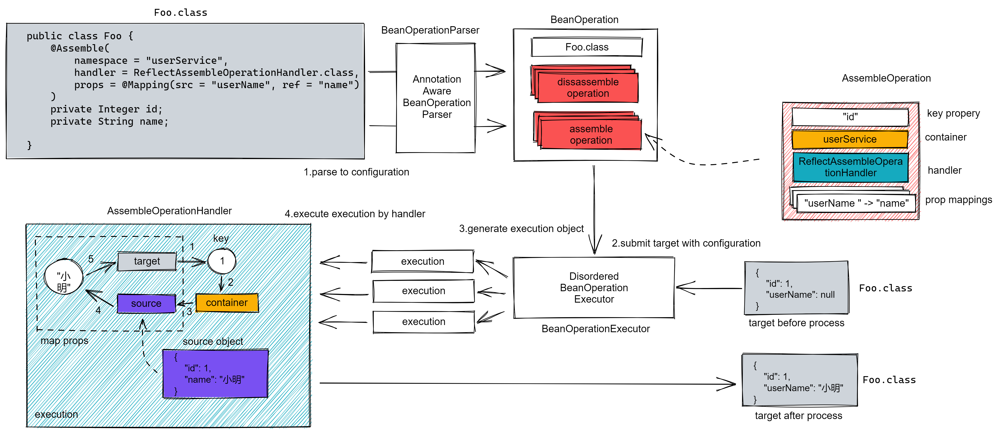

# 原理

`crane4j` 的整体执行流程可大致分为两阶段：

- **配置解析阶段**：根据 `AnnotatedElement` （一般是类或者方法）解析获得对应的操作配置对象 `BeanOperations`，通过该配置对象我们可以知道一个对象中有多少个字段需要处理，要怎么处理，在 `BeanOperation` 里面，一个 `key` 字段对应的一个操作会被转为一个 `Operation` 对象；
- **操作执行阶段**：输入要处理的对象，与该对象类型对应操作配置，然后交由操作执行器 `BeanOperationExecutor` 生成待完成的任务 `Execution`，并最终分发给操作执行器 `OperationHandler`，`OperationHandler` 会根据配置从数据源获得对象，并完成具体的字段映射；

简而言之，和 Spring 类似，配置解析阶段最终的产物是 `BeanOperations`，而执行阶段所有的组件都围绕 `BeanOperations` 的配置执行。

上图描述了一个 `Foo` 对象，是如何通过 `id` 获得数据源，并最终将数据源中的 `userName` 字段值映射到 `Foo` 的 `name` 字段上的过程。
